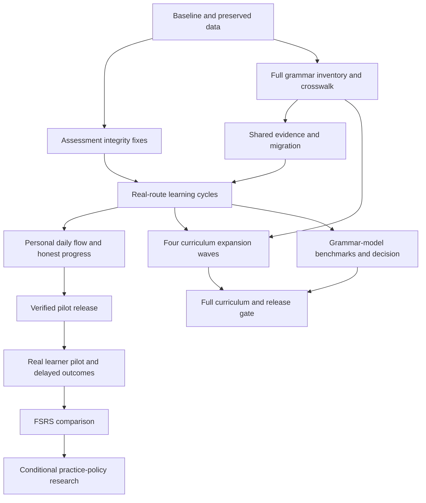

**Roadmap for fixing and implementing English and German grammar automaticity**

Created 4 September 2026 for `D:\APPS_root_new`. This roadmap implements the [agreed strategy](LANGUAGE-AUTOMATICITY-STRATEGY-2026-09-04.md). It covers both language apps and their shared learning code.

There are **45 work packages: 40 required and 5 conditional**. All implementation packages are initially **planned**. Earlier source findings explain the priorities; they do not mean these fixes or learner outcomes are complete. The [structured backlog](language-automaticity-implementation-backlog.json) records each task's dependencies, owner role, affected areas, full acceptance criteria and evidence list.

**Implementation started on 4 September 2026.** The first increment fixes assessment integrity and prepares isolated release verification. Current changes, checks and remaining gates are recorded in the [implementation record](LANGUAGE-AUTOMATICITY-IMPLEMENTATION-2026-09-04.md). Completing this increment does not close the full learning-loop or curriculum release.

**Execution order and first deliverable.** Start with B01, then B02/B03/C01. As those finish, run the English upstream fix F01, German detection/normalisation fix F02, shared contract E01, curriculum crosswalk C02/C03, and release-checklist preparation R01 on separate files. Follow with evidence reduction, migration, browser-bundle sync, exposure protection and route integration. The first release is R02: a small but complete, reliable learning loop in both apps. It is explicitly not full grammar completion.

The arrows show the main sequence. The task-level dependencies below and in the JSON are authoritative. Content authoring and model evaluation can proceed alongside integration once their inputs exist. A wave is an authoring group, not a compulsory learner level or a single English/German grammar sequence.

**Completion has three separate meanings.**

| Track | Completion condition |
| --- | --- |
| Technical first release | R02: the shared learning loop, daily flow, active routes and installer lifecycle pass their checks |
| Full curriculum release | W05 + R03: all required construction/mode/stage cells are implemented, reviewed, assessable and verified |
| Learning evidence | P03: real unaided samples show the measured outcomes and limitations; improvement is reported only if observed |

M04, S03 and X01-X03 are conditional. A model or scheduler that fails evaluation stays disabled. Deferring RL does not leave the core grammar product unfinished. Conversely, unavailable review or unsupported assessment for a required grammar cell cannot be hidden by marking that cell N/A.

Roles in the backlog describe the work needed. No teacher/reviewer is assumed assigned, and no learner session is assumed booked. Engineering can continue on unaffected tasks while human review is pending. A genuine blocker records its reason and affected deliverable; it does not mark the whole project blocked.

**Scheduling and estimates.** Use dependency batches rather than promise a finish date now. After B03, estimate defect and migration work from reproductions. After C04 and two completed representative family packs, estimate remaining authoring from actual construction counts, review time and evaluator gaps. Report engineering effort, reviewer availability and learner elapsed time separately. Delayed checkpoints require real elapsed days; a test clock verifies code only. A 30-day retention checkpoint is an observation point, not a promise to automatise all grammar in 30 days.

**Work packages.** Each dependency means its input/acceptance condition must be satisfied before the dependent task can be called complete. Drafting independent work may start earlier when shared contracts are stable. Detailed cases and exact integration-area paths are in the structured backlog.

**Establish the current baseline (P0).** Exit: Canonical routes and storage mapped; preservation fixtures and defect reproductions saved.

| ID | Work and deliverable | Depends on | Affected areas |
| --- | --- | --- | --- |
| B01 | Map active routes and current runtime. Dated route/storage/version map and English/German HTTP/browser baseline. | None | root, release, en_static, de_static, en_features, de_features |
| B02 | Prepare preservation and restore fixtures. Local export fixtures covering attempts, due reviews, settings, drafts and playable audio. | B01 | core, en_features, de_features, en_client, release |
| B03 | Reproduce consequential defects. Focused regression ledger with expected verdicts and route evidence. | B01 | en_assessment, en_client, de_domain, en_static, de_static, core |

**Fix incorrect assessment and evidence (P0).** Exit: Known false-success, answer-exposure and verification-conflict cases cannot award independent credit.

| ID | Work and deliverable | Depends on | Affected areas |
| --- | --- | --- | --- |
| F01 | Validate English upstream assessments. Strict upstream validation and explicit unassessed results. | B03 | en_assessment, en_client |
| F02 | Fix German language and orthography handling. Guarded language classification and task-specific normalisation. | B03 | de_domain, de_static |
| F03 | Separate practice completion from independent success. Exposure-aware examples, hints, repairs and completion flags. | B03, E01, C03 | en_static, de_static, en_features, de_features |
| F04 | Remove conflicting verification paths. A single assessment result supplies both application state and evidence. | B03, E01, E02 | core, en_client, en_features, de_domain, de_features |

**Build the shared evidence foundation (P0).** Exit: One versioned record and reducer serve both apps without losing historical data.

| ID | Work and deliverable | Depends on | Affected areas |
| --- | --- | --- | --- |
| E01 | Define versioned construction, task and assessment contracts. Shared schema version and typed English/German adapters. | B03, C01 | core, de_contracts, en_content, de_content |
| E02 | Implement idempotent evidence reduction. Deterministic event reducer and modality-specific summaries. | E01 | core, de_domain |
| E03 | Migrate legacy and static-route state safely. Versioned migration, aliases, export/restore and rollback. | B02, E01, E02, C02 | core, en_features, de_features, en_static, de_static, en_client |
| E04 | Distribute shared code to every runtime. Updated sync file list, schemas and static-browser entry bundle. | E01 | core, en_scripts, de_scripts |

**Map the complete grammar scope (P1).** Exit: All current lessons and all 21 families mapped; every missing required cell creates work.

| ID | Work and deliverable | Depends on | Affected areas |
| --- | --- | --- | --- |
| C01 | Define the grammar-construction inventory. Stable language-specific construction IDs across all 21 strategy families. | B01 | en_content, de_content, docs |
| C02 | Map every existing lesson and identify missing constructions. English/German crosswalk and explicit missing-coverage backlog. | C01 | en_content, de_content |
| C03 | Define appropriate task types and separate exposed material. Typed task families and teaching/practice/calibration/final-test partition rules. | C01 | en_content, de_content, core |
| C04 | Build an executable coverage gate. Generated coverage matrix and actionable missing-cell report. | C02, C03, E01 | core, en_content, de_content, en_scripts, de_scripts |

**Connect complete learning cycles (P1).** Exit: Representative speaking and writing cycles work on actual static and React routes.

| ID | Work and deliverable | Depends on | Affected areas |
| --- | --- | --- | --- |
| L01 | Implement representative construction validators and tasks. Reviewed bilingual packs for inflection, valency, temporal meaning, clause order, modality/voice and discourse. | F01, F02, E01, C03 | en_content, de_content, en_client, de_domain |
| L02 | Make audio and response timing trustworthy. Playable audio, transcript provenance and valid response-timing capture. | E01, B02 | core, en_client, en_features, de_features |
| L03 | Integrate actual Daily and Grammar routes. Shared assessment/evidence on /daily, /grammar, /heute and /grammatik. | F03, F04, E03, E04, L01 | en_static, de_static, en_scripts, de_scripts |
| L04 | Integrate Studio, Errors, Reviews, Progress and teacher review. All remaining learning surfaces read and write the same evidence. | F04, E03, E04, L01, L02 | en_features, de_features, en_client, de_domain |
| L05 | Verify the representative end-to-end learning cycle. Browser receipts for both languages and both productive modes. | L03, L04, L02, C04 | en_tests, de_tests, core |

**Make daily practice usable and personal (P1).** Exit: The learner can start, repair, resume and review with clear reasons and honest progress.

| ID | Work and deliverable | Depends on | Affected areas |
| --- | --- | --- | --- |
| U01 | Implement transparent personal task selection. Rule-based selection using eligible evidence, prerequisites, reviews and coverage. | E02, C02, L05 | core, en_client, de_domain |
| U02 | Deliver one clear daily card with reliable resume. Daily card with target, reason, action, session budget and next step. | U01, L03, L04 | en_static, de_static, en_features, de_features |
| U03 | Replace unsupported progress and CEFR claims. Dated construction-by-mode progress with counts and uncertainty. | E02, L04, L02 | core, en_features, de_features, de_domain |
| U04 | Verify offline recovery, consent and accessibility. Verified recoverable offline and accessible learning flow. | U02, U03, L02 | en_static, de_static, en_features, de_features, core |

**Evaluate and integrate suitable model assistance (P1).** Exit: Task-specific benchmarks determine supported families; unsupported functions abstain.

| ID | Work and deliverable | Depends on | Affected areas |
| --- | --- | --- | --- |
| M01 | Create reviewed English and German assessment benchmarks. Versioned development/calibration/final-test sets, beginning with pilot scope and expanding to every family. | C03, E01, L01 | docs, en_content, de_content |
| M02 | Compare rules, LanguageTool and pretrained candidates. Compare each release scope and record the construction, content and benchmark versions. | M01, F01, F02 | en_client, de_domain, research |
| M03 | Decide which assessment functions are supported. Approve only evaluated families/modes; renew approval as the curriculum expands. | M02 | docs, core |
| M04 · conditional | Integrate a qualified Transformer through the shared contract. Optional model adapter with version pinning, structured outputs and fallback. | M03, L04, U04 | en_assessment, en_client, de_domain, de_contracts |

**Complete all grammar families (P1).** Exit: Every required curriculum cell has reviewed content, an appropriate assessment path and verified learner-route evidence.

| ID | Work and deliverable | Depends on | Affected areas |
| --- | --- | --- | --- |
| W01 | Complete foundation and reference families. Both languages complete families G01,G02,G03,G04,G05,G13. | C04, L05 | en_content, de_content, en_scripts, de_scripts |
| W02 | Complete temporal and verb-system families. Both languages complete families G06,G07,G08,G09,G10. | C04, L05 | en_content, de_content, en_client, de_domain |
| W03 | Complete complex proposition families. Both languages complete families G11,G12,G14,G15,G16. | C04, L05 | en_content, de_content, en_client, de_domain |
| W04 | Complete discourse, advanced integration and orthography. Both languages complete families G17,G18,G19,G20,G21. | C04, L05 | en_content, de_content, en_client, de_domain |
| W05 | Close the full-curriculum coverage gate. Signed-off coverage report for every in-scope construction in both languages. | W01, W02, W03, W04, M03, U04 | core, en_content, de_content, en_scripts, de_scripts, en_tests, de_tests |

**Measure independent learner performance (P1).** Exit: Dated baseline, transfer and delayed outcomes reported separately by language and mode.

| ID | Work and deliverable | Depends on | Affected areas |
| --- | --- | --- | --- |
| P01 | Prepare personal baseline and evaluation protocol. Dated unaided speaking/writing baseline and matched new follow-up prompts. | C03, M01 | docs |
| P02 | Run daily learning on the verified pilot release. Prospective dated practice and assistance evidence on reviewed target packs. | P01, R02 | docs |
| P03 | Measure transfer and delayed retention. Language/mode-specific outcome report with dated independent probes. | P02 | docs |

**Evaluate adaptive review scheduling (P2).** Exit: A prospective comparison supports activation or documents retention of the baseline.

| ID | Work and deliverable | Depends on | Affected areas |
| --- | --- | --- | --- |
| S01 | Make prospective FSRS history evidence-eligible. Validated review-event mapping with repeated-item memory separate from transfer. | E02, L04, U01 | core, en_features, de_features |
| S02 | Qualify FSRS in shadow, then compare candidate review dates. Follow prediction checks with a bounded learner comparison before broad activation. | S01, P03 | core, docs |
| S03 · conditional | Activate a qualified scheduler reversibly. Optional staged scheduler activation with replayable state and rollback. | S02, R03 | core, en_features, de_features |

**Verify each delivered increment (P0).** Exit: Exact build and installer receipts demonstrate functional routes and data preservation.

| ID | Work and deliverable | Depends on | Affected areas |
| --- | --- | --- | --- |
| R01 | Prepare the repeatable release and preservation checklist. Exact command map, isolated lifecycle fixture and evidence receipt template. | B01, B02 | release, en_scripts, de_scripts, en_tests, de_tests |
| R02 | Deliver and verify the first learning-loop release. Exact English/German pilot installers and route/preservation receipts. | L05, U04, R01 | release, en_scripts, de_scripts, en_tests, de_tests |
| R03 | Deliver the full-curriculum release. Exact release versions with complete coverage and lifecycle evidence. | W05, U04, R01, R02 | release, en_scripts, de_scripts, en_tests, de_tests |

**Consider reinforcement learning only with sufficient evidence (P3).** Exit: A recorded decision either opens a bounded experiment or defers it without blocking the core product.

| ID | Work and deliverable | Depends on | Affected areas |
| --- | --- | --- | --- |
| X01 · conditional | Assess readiness for a contextual-bandit experiment. Conditional research decision with adequate-data and evaluation-design assessment. | P03, S02, M03 | core, docs |
| X02 · conditional | Compare a bounded practice-selection policy. Optional contextual-bandit experiment with immutable final test and fallback. | X01, R03 | core, docs |
| X03 · conditional | Decide whether sequential RL adds value. Optional evidence-based decision, including an explicit defer outcome. | X02 | docs |

**Full curriculum expansion: all 21 families, both languages.** The 112 English and 144 German units are the starting crosswalk. Add reviewed omissions and preserve original identities. C04 establishes the coverage denominator, and W05 closes it. Do not replace these gates with a lesson-count percentage.

| Family | Grammar scope | Expansion package |
| --- | --- | --- |
| G01 | Basic clause structure | W01 |
| G02 | Nouns and reference | W01 |
| G03 | Determiners | W01 |
| G04 | Pronouns | W01 |
| G05 | Adjectives and adverbs | W01 |
| G06 | Present and past | W02 |
| G07 | Future and temporal relations | W02 |
| G08 | Verb patterns and valency | W02 |
| G09 | Nonfinite constructions | W02 |
| G10 | Modality | W02 |
| G11 | Voice and causation | W03 |
| G12 | Negation and questions | W03 |
| G13 | Prepositions | W01 |
| G14 | Clause linking | W03 |
| G15 | Relative clauses | W03 |
| G16 | Conditionals and hypothetical meaning | W03 |
| G17 | Reported language | W04 |
| G18 | Information structure | W04 |
| G19 | Cohesion and register | W04 |
| G20 | Advanced integration | W04 |
| G21 | Orthography supporting grammar | W04 |

The four waves may be authored in parallel. Integrated release requires each construction's actual prerequisites: relative-pronoun case needs case roles/valency; modal passive needs modality and voice; participial attributes need adjective inflection and nonfinite forms. Orthography applies from the first task even though its final coverage closure belongs to W04.

Every family package must supply:

- Reviewed form/meaning/use, prerequisites, contrasts, accepted variants, source provenance and stable IDs.
- Suitable comprehension, retrieval, variation, written and spoken production, repair, unfamiliar-context transfer and delayed review, with justified modality-specific N/A.
- Separate teaching/practice material and protected assessment variants; hint/model exposure must be recorded.
- Correct, incorrect, alternative, ambiguous, irrelevant and unsupported cases for each evaluator.
- An available assessment path, named as automatic or human-reviewed; unassessed required cells remain open.
- Generated catalog parity and an actual learner-route journey that saves consistent evidence.

Use child tickets for each **language × construction × missing coverage cell** identified by C04. Each child must name its parent W01-W04 package, task IDs, evaluator, reviewer status and evidence. Complete the parent only when all its required children pass. This avoids hiding the large authoring workload inside four apparently small tasks.

**Acceptance cases that must be in the first regression pack.**

| Failure being repaired | Required observed result |
| --- | --- |
| English provider returns valid `matches: []` | Valid assessment; still evaluate target use and task requirements |
| Provider returns missing/null/non-array matches, broken edits, invalid JSON or times out | Affected dimensions are unassessed; no mastery increase |
| German text is clearly another language, or too ambiguous to classify | Correct rejection or uncertainty; do not default arbitrary Latin text to German |
| A correct alternative differs from the example | Accept under the appropriate rubric; no exact-string rule for open production |
| A hint or answer has already been revealed | Save practice/repair; withhold independent-retrieval credit |
| An open answer is saved while the evaluator is offline | Completion may be saved; assessed success is not fabricated |
| A response contains a keyword in the wrong grammatical role | No target-use credit from the keyword alone |
| Static and React routes submit the same attempt | One event identity and one evidence verdict |
| An ASR transcript is edited or audio is missing | Preserve original provenance; do not claim original spoken correctness |
| A teacher overturns a model verdict | Preserve history, invalidate the old assessment, recompute the repair queue and progress |
| A due review is opened immediately or reuses a revealed answer | No genuine delayed/novel-transfer claim |
| An old backup is migrated twice, or migration is interrupted | Idempotent IDs, preserved data, recoverable pre-migration state |

**Verified integration areas.** Paths below exist in the current checkout. Task-specific new modules, schemas, benchmarks and reports are deliverables to create, not files claimed to exist already.

| Area key | Existing location | Responsibility |
| --- | --- | --- |
| root | [.](../.) | Workspace, runtime manifest and task evidence |
| release | [scripts](../scripts) | Readiness and isolated installer lifecycle |
| core | [shared/learning-core](../shared/learning-core) | Canonical shared contracts, evidence, scheduling and mirror sync |
| en_content | [Apps/English/English-Automaticity/packages/content/src](../Apps/English/English-Automaticity/packages/content/src) | English curriculum, taxonomy, task authoring |
| de_content | [Apps/Deutsch-Automaticity/packages/content/src](../Apps/Deutsch-Automaticity/packages/content/src) | German curriculum and exercise completion |
| en_assessment | [Apps/English/English-Automaticity/apps/api/src/assessment](../Apps/English/English-Automaticity/apps/api/src/assessment) | English upstream assessment contract and service |
| en_client | [Apps/English/English-Automaticity/apps/web/lib](../Apps/English/English-Automaticity/apps/web/lib) | English assessment, audio and planning adapters |
| de_domain | [Apps/Deutsch-Automaticity/packages/domain/src](../Apps/Deutsch-Automaticity/packages/domain/src) | German pure evaluation, mastery and scheduling |
| de_contracts | [Apps/Deutsch-Automaticity/packages/contracts](../Apps/Deutsch-Automaticity/packages/contracts) | German versioned API contracts |
| en_static | [Apps/English/English-Automaticity/apps/web/public/replacements/en](../Apps/English/English-Automaticity/apps/web/public/replacements/en) | Active English Daily and Grammar runtime |
| de_static | [Apps/Deutsch-Automaticity/apps/web/public/replacements/de](../Apps/Deutsch-Automaticity/apps/web/public/replacements/de) | Active German Daily and Grammar runtime |
| en_features | [Apps/English/English-Automaticity/apps/web/features](../Apps/English/English-Automaticity/apps/web/features) | English state, Studio, progress and review |
| de_features | [Apps/Deutsch-Automaticity/apps/web/src/features](../Apps/Deutsch-Automaticity/apps/web/src/features) | German state, Studio, progress and review |
| en_scripts | [Apps/English/English-Automaticity/scripts](../Apps/English/English-Automaticity/scripts) | English generated curriculum, payload and installer |
| de_scripts | [Apps/Deutsch-Automaticity/scripts](../Apps/Deutsch-Automaticity/scripts) | German generated curriculum, payload and installer |
| en_tests | [Apps/English/English-Automaticity/tests/e2e](../Apps/English/English-Automaticity/tests/e2e) | English browser journeys |
| de_tests | [Apps/Deutsch-Automaticity/tests/e2e](../Apps/Deutsch-Automaticity/tests/e2e) | German browser journeys |
| research | [research/cefr-classification](../research/cefr-classification) | Existing CEFR research; separate from grammar feedback |
| docs | [docs](../docs) | Strategy, reviewed scope, reports and protocols |

English `apps/web/next.config.mjs` rewrites `/daily` and `/grammar`; German `apps/web/next.config.ts` rewrites `/heute` and `/grammatik`. Trace the other surfaces in B01 instead of assuming a React component is the active route. English generates its catalog through `scripts/sync-grammar-replacement.ts`; German uses `scripts/generate-german-grammar-replacement.ts`. Update sources and regenerate rather than patch generated catalog output alone.

**Verification commands and evidence.** These commands were located in current scripts; they were not executed as part of creating this roadmap. Run relevant checks for each change, then the required release suite. Recheck scripts and instructions when implementation starts.

| Working directory | Command | Purpose |
| --- | --- | --- |
| Repository root | `node shared/learning-core/sync-workspaces.mjs --check` | Verify both shared package mirrors and browser bundles |
| `shared/learning-core` | `bun test` | Verify the changed shared contracts and reducers |
| English app root | `bun run check` | Content parity, types, unit/API tests, installer tests and lint |
| English app root | `bun run build` | Build web/API and standalone payload |
| English app root | `bun run test:e2e` | Verify actual English browser journeys |
| German app root | `bun run verify` | Required formatting, lint, type, test, installer, schema and build gates |
| German app root | `bun run test:integration` | API/domain integration |
| German app root | `bun run test:e2e` | Verify actual German browser journeys |
| Repository root, after restart | `node scripts/release-readiness.mjs --only=english --skip-build --skip-public` | Local English HTML/API readiness |
| Repository root, after restart | `node scripts/release-readiness.mjs --only=german --skip-build --skip-public` | Local German HTML/API readiness |
| Each changed app root | `bun run package:windows-exe` | Rebuild installer and Install/Update/Repair payload |
| Repository root | `./scripts/verify-language-installer-cycle.ps1 -Product English -SetupPath <exact-built-setup-path>` | Isolated English lifecycle against a resolved artifact |
| Repository root | `./scripts/verify-language-installer-cycle.ps1 -Product German -SetupPath <exact-built-setup-path>` | Isolated German lifecycle against a resolved artifact |

The lifecycle commands contain a placeholder: resolve the exact built setup path before execution. Review the script's isolated install/data roots and confirm path boundaries. Use R01 to add an actual previous-version-to-new-version migration and content-rich preservation fixtures; reinstalling the same setup is insufficient evidence for schema migration. Do not stop unrelated services or run uninstall against a normal user installation as a test.

R01's checklist repeats at **every delivered code increment**, including each curriculum wave and any later model/scheduler change. R02 and R03 are named milestones, not the only times to verify delivery. A private work-in-progress need not claim release readiness. Public deployment and public runtime checks form a separate delivery decision; a localhost pass is not proof of a public deployment.

Each ticket's evidence entry must record the date, source revision and relevant worktree state, language/mode, test or observation method, output path and result. Each release receipt also needs the exact version/setup path/hash, install/start/update/repair results, preserved-record comparison and post-restore audio playback. Record failed or unavailable checks as such. Never infer microphone success, teacher review, learner improvement or portable signing trust from a build.

**Model and learning decisions that must remain separate.**

M01-M03 evaluate grammar feedback, not overall CEFR classification. Approvals are versioned by released construction/content scope: the representative scope can support P01/R02 without waiting for all 21 families, while W05 requires refreshed full-scope benchmark evidence. Later families cannot inherit an earlier approval. Existing CEFR checkpoints remain governed by their current no-integration evidence. A selected M04 adapter becomes a conditional dependency for both R02 and R03 when that release advertises it; otherwise record its deferral and the available baseline/human assessment scope.

P01-P03 require learner-authored samples and review. Accuracy and independent target opportunities are primary; pair timing with difficulty and accuracy. Keep language, mode, hint exposure, prompt novelty, elapsed delay and intervening practice visible. The experimental dataset used to tune a model or policy is not the untouched final evaluation set. Statistical or educational claims require their own evidence beyond the software regression pack.

S01 starts by cleaning prospective FSRS event eligibility. S02 has two stages: shadow qualification for recall prediction/simulated workload, then a predeclared, bounded learner comparison using actual candidate review dates if qualification supports proceeding. The comparison needs learner opt-in, the R01 release checks, eligible target selection and rollback controls; broad activation remains disabled until S03. Shadow predictions alone cannot prove that changed intervals improve learning. X01-X03 are later options: reliable rewards, sufficient observations, action probabilities and a defensible evaluation design are prerequisites. The core roadmap ends successfully even if a documented decision leaves RL deferred.

**How to keep the roadmap current.** Update the JSON ticket status and attach evidence when work occurs; keep this Markdown summary aligned with changed scope or dependencies. `implemented` means verification is still pending. `verified` means only that the ticket's own acceptance criteria have evidence. Conditional `deferred` work needs a recorded reason; required missing coverage cannot be deferred while declaring the full curriculum complete. New defects create linked tickets rather than disappearing inside a green phase.

The first concrete implementation batch is **B01-B03, F01-F02, C01-C03, E01 and R01**, in the dependency order above. It prepares the full-curriculum migration while removing the most direct sources of misleading learner feedback.
