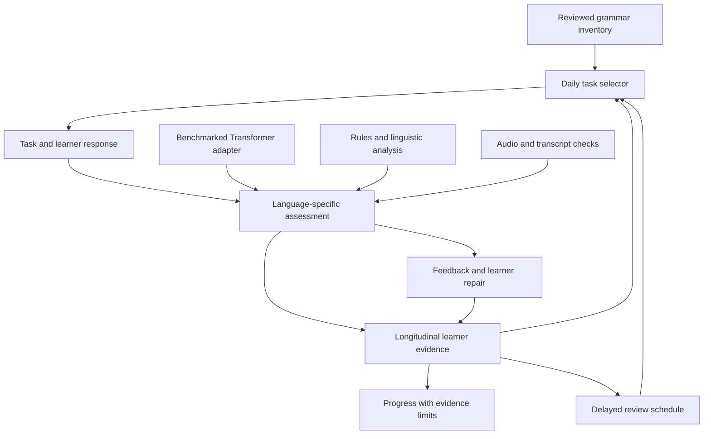

**English and German grammar automaticity: product and implementation strategy**

Date: 4 September 2026. Scope: the English and German learning products in `D:\APPS_root_new`. Status: design specification; implementation and learning outcomes described below are proposed unless explicitly identified as existing source. The examples supplied in the conversation illustrate the problem; they do not limit the curriculum or establish the learner's proficiency.

Implementation tasks, dependencies and release gates are tracked in the [implementation roadmap](LANGUAGE-AUTOMATICITY-IMPLEMENTATION-ROADMAP.md) and its [structured backlog](language-automaticity-implementation-backlog.json).

The intended outcome is accurate, increasingly fluent, independent use of grammar in new spoken and written situations, retained over time. The system must cover the full declared curriculum while selecting a manageable daily workload. Curriculum coverage, software correctness, and evidence of learning are separate completion criteria.

The current source audit found 112 English grammar units and 144 German grammar units. Both are the starting inventory, not a ceiling: add missing constructions when the source-to-curriculum review identifies them. English `/daily` and `/grammar`, and German `/heute` and `/grammatik`, currently rewrite to static replacement pages. The implementation must reach these learner-facing routes as well as React/domain modules. [English route configuration](../Apps/English/English-Automaticity/apps/web/next.config.mjs), [German route configuration](../Apps/Deutsch-Automaticity/apps/web/next.config.ts).

The audit also found source-level evidence conflicts: English has a flow that records an unverified attempt in app state while sending a deterministic-verified result to the evidence bundle; shared transfer flags can derive from route/due-review flags without explicit novelty records; German closed practice can display the examples from which answers are derived. These require integration fixes, not simply a more capable model. [English flow](../Apps/English/English-Automaticity/apps/web/features/screens/automaticity-screen.tsx), [shared evidence builder](../shared/learning-core/src/index.ts), [German runtime](../Apps/Deutsch-Automaticity/apps/web/public/replacements/de/grammar-runtime.js). These are source observations; this strategy work did not rerun complete browser or installer verification.

**1. Use a hybrid design, with each component assigned a specific job.**

| Component | Responsibility | Decision |
| --- | --- | --- |
| Authored grammar inventory and prerequisite map | Define what is taught, the meaning of each construction, acceptable variants, and assessment coverage | Required foundation for both languages |
| Deterministic checks and linguistic analysis | Validate task contracts; assess constrained answers; identify supported morphological and syntactic patterns | Implement and test first; do not equate a keyword match with correct usage |
| Pretrained Transformer language model | Propose open-answer corrections, interpret meaning and context, explain errors, suggest controlled task variations | Add through a benchmarked adapter with explicit abstention; never grant mastery directly |
| Speech processing | Capture playable audio, obtain a transcript, measure usable timing, and assess validated audio dimensions | Track audio evidence separately from transcript grammar |
| Review scheduler | Decide when a previously practised item should return | Keep the existing baseline; evaluate the existing FSRS implementation before activation |
| Practice-selection policy | Choose which eligible target and activity come next | Start with transparent rules; evaluate a contextual bandit only after suitable longitudinal evidence exists |
| Longitudinal evidence store | Record what the learner actually produced, assistance, corrections, context, and delayed outcomes | Sole input to progress decisions; neither a model nor a timer can bypass it |

A Transformer is a model architecture. Reinforcement learning is a method for learning a decision policy from outcomes. They are not competing alternatives for the same job. Training a new language model from scratch is outside the initial product scope. A pretrained model can be useful without training a reinforcement-learning policy.

The hybrid choice is a design recommendation. English GEC research finds that model rankings depend on the task and correction style; a fluent rewrite is not automatically a better minimal correction. A recent English Grammar Profile preprint also reports different strengths for rule-based and LLM-based construction analysis. Its findings motivate an experiment here, not a claim of validated German performance. [Davis et al., 2024](https://aclanthology.org/2024.findings-acl.711/), [Bannò et al., 2026, preprint](https://arxiv.org/abs/2603.17171).

**2. Define full coverage as an auditable curriculum, not a lesson count.**

Use a versioned inventory of grammar constructions. A construction connects form, meaning, and use: a heading such as "passive" is too broad to be one mastery item. Split it into observable abilities, such as choosing an appropriate passive, forming it, interpreting the agent, and using it in a relevant explanation. Record common confusions and prerequisites without forcing a single linear path through every topic.

The following is the scope checklist for the inventory. It is not a claim that every listed subskill already has complete content or verified assessment.

| Family | English coverage | German coverage |
| --- | --- | --- |
| Basic clause structure | Subject, predicate, objects, agreement, complements, constituent order | V2/V1, subject agreement, sentence brackets, complements, constituent order |
| Nouns and reference | Countability, number, irregular plurals, possession, reference | Gender with the noun, plurals, compounds, case roles, weak nouns, possession |
| Determiners | Definite/indefinite/zero articles, demonstratives, possessives, quantifiers | Article words, negative articles, possessives, demonstratives, determiner inflection |
| Pronouns | Subject/object, possessive, reflexive, reciprocal, indefinite, relative; clear antecedents | Personal, reflexive, reciprocal, possessive, demonstrative, indefinite and relative forms; pronominal adverbs |
| Adjectives and adverbs | Position, comparison, degree, adjective/adverb distinctions | Strong/weak/mixed adjective inflection, comparison, attributive/predicative use, adverb placement |
| Present and past | Simple/progressive/perfect contrasts, stative verbs, narrative sequencing, habitual meaning | Present, Perfekt, Präteritum, Plusquamperfekt, auxiliary selection, participles and temporal interpretation |
| Future and temporal relations | Predictions, intentions, arrangements, future continuous/perfect, time clauses | Present/future alternatives, Futur I/II, temporal clauses and time-reference contrasts |
| Verb patterns and valency | Transitivity, double objects, verb-preposition frames, phrasal verbs | Accusative/dative/genitive/prepositional complements, separable/inseparable verbs, reflexive constructions |
| Nonfinite constructions | Infinitives, gerunds, participles, meaning changes, purpose clauses | Infinitives with/without zu, um/ohne/anstatt zu, participles, extended attributes |
| Modality | Ability, permission, obligation, advice, deduction, probability, modal perfects | Modal verbs, modal clusters, objective/subjective readings, Ersatzinfinitiv, alternatives |
| Voice and causation | Active/passive, passive with modals, causatives, agent and information choices | Vorgangs-/Zustandspassiv, modal passive, passive alternatives, lassen constructions |
| Negation and questions | Do-support, negatives, interrogatives, indirect questions, question tags | Nicht/kein placement and scope, yes/no and W-questions, indirect questions |
| Prepositions | Time/place/movement, dependent prepositions, meaning contrasts | Fixed-case and two-way prepositions, location/direction, government and idiomatic combinations |
| Clause linking | Coordination and subordination; reason, purpose, result, contrast, concession, time | Conjunctions versus connecting adverbs; verb-final clauses; causal, final, consecutive, concessive, temporal links |
| Relative clauses | Defining/non-defining, pronoun choice, omission, reduced relatives | Relative-pronoun gender/number/case, prepositions, free and extended relatives |
| Conditionals and hypothetical meaning | Real/unreal/mixed conditions, wishes, unreal past, alternatives to if | Wenn/falls, Konjunktiv II, present/past counterfactuals, wishes and polite distancing |
| Reported language | Statements/questions/commands, tense and reference shifts, reporting verbs | Direct/indirect speech, Konjunktiv I/II, reference and register |
| Information structure | Inversion, clefts, emphasis, fronting, existential constructions | Vorfeld/Mittelfeld/Nachfeld, ordering of noun/pronoun complements, es constructions, focus |
| Cohesion and register | Reference chains, ellipsis, substitution, linking, hedging, spoken/written conventions | Reference chains, connectors, ellipsis, modal particles, politeness, spoken/written conventions |
| Advanced integration | Nominalisation, compression, complex phrases, ambiguity control, genre-appropriate grammar | Nominal/verbal style, complex noun phrases, participial compression, ambiguity control, genre-appropriate grammar |
| Orthography supporting grammar | Sentence boundaries, capitals, apostrophes, punctuation | Noun capitalisation, compounds, commas and clause boundaries |

Associate constructs with A1-C2 learning bands using reviewed sources. Do not force English and German into identical topic counts or identical grammatical sequences. Higher proficiency also involves reliable use of familiar grammar under greater communicative demands. The CEFR provides descriptors, while English Profile provides language-specific descriptions; use IDS grammis and reviewed German curriculum sources for German analysis. Source mappings remain guidance, not an automatic CEFR certificate. [Council of Europe](https://www.coe.int/en/web/common-european-framework-reference-languages/cefr-companion-volume-and-its-language-versions), [English Profile](https://englishprofile.org/), [IDS grammis: complements and valency](https://grammis.ids-mannheim.de/systematische-grammatik/1308).

For every existing lesson, map its stable ID to one or more construction IDs. For every declared construction, record explanation, comprehension task, constrained retrieval, spoken production, written production, repair, unfamiliar-context transfer, delayed review, evaluator, and source/review status. Mark missing cells explicitly. Some modality-specific skills, such as written punctuation, need a justified N/A instead of an artificial speaking test.

Each matrix cell has a named status: `missing`, `authored`, `reviewed`, `implemented`, `technically_verified`, or `N/A_with_reason`. Record learner-outcome evidence separately; a reviewed worksheet is not an implemented app flow. Save source mappings, reviewer/date, task-family IDs, evaluator version, and the browser journey that proves a cell works. The curriculum crosswalk must account for all current IDs and every in-scope construction found in the reviewed references.

Coverage completion requires every lesson to be mapped and every required construction-by-mode cell to be implemented and reviewed. Counts of questions, matching file structures, and renamed generic templates do not satisfy this condition. Material from owned books can inform original practice and link to the learner's local source; do not redistribute licensed pages or exercises in installers or training data.

**3. Personalise the path across the entire inventory.**

Start with separate English and German profiles. Use short, unaided writing and speaking samples plus targeted diagnostic tasks. A free sample cannot reveal every grammar weakness, so add small diagnostic probes over successive sessions. Untested constructions stay "not yet checked", not "weak" or "mastered". Do not require a full curriculum examination before useful practice starts.

Select one or two focus constructions per ordinary session, keep at most five active repair priorities visible, and retain all other evidence in the background. This is an attention limit, not a five-topic curriculum. Sample other eligible families periodically so the learner does not become trapped practising only familiar errors. Offer a short challenge to bypass a prerequisite when actual performance supports it.

Maintain grammar accuracy, vocabulary access, comprehension, writing, speech, and assistance separately. A missing word should not automatically diagnose faulty syntax. Reduce unnecessary vocabulary difficulty when testing a grammar target; later vary vocabulary and context to test transfer. Persian explanations may clarify a contrast when helpful, then fade prompts toward the target language. Do not infer a Persian-transfer error without observing it.

**4. Give every applicable construction the same complete learning cycle, with suitable task types.**

| Stage | Learner action | What the system records |
| --- | --- | --- |
| Notice and understand | Interpret a short spoken/written example and distinguish a meaningful contrast | Comprehension; no productive mastery credit |
| Retrieve | Produce a form or clause from a meaning cue without a displayed solution | Correctness, assistance, target opportunity, attempt timing |
| Vary | Change person, number, time, polarity, complement, or context where the construction permits it | Generalisation across valid transformations |
| Produce | Express an original meaning in speech or writing | Grammatical accuracy, target use, relevance, comprehensibility |
| Repair | Identify the consequential error, use a hint, then reconstruct the sentence | Original attempt, assistance level, learner-authored repair |
| Transfer | Respond to a new situation with changed meaning, vocabulary, or discourse demands | Whether the construction is independently and appropriately used |
| Retain | Complete a comparable, unexposed task on a later day | Delayed independent performance, lapses, renewed review needs |

Transformations must preserve a meaningful task. Do not generate a negative, passive, or tense substitution merely because a template can do it. Use task families such as role-play, information gaps, describing changes, retelling, requests, explanations, comparisons, and short messages. Advanced work adds connected discourse and register demands rather than simply lengthening every sentence.

Distinguish three transfer conditions: a new item that explicitly names the target; a communicative task that elicits the target without naming it; and genuinely free communication. Record which was used. In free communication, a valid alternative is not an error merely because the learner avoided the intended construction; record that the target was not observed. Design diagnostic situations that create natural opportunities for the construction.

Immediate repair and reading a corrected sentence are useful practice, but cannot count as an independent delayed success. After revealing a solution, tag that item as exposed and later use a different eligible task. Repetition studies distinguish performance on practised tasks from transfer and retention; the app must do the same. [Suzuki and Hanzawa](https://www.cambridge.org/core/journals/studies-in-second-language-acquisition/article/massed-task-repetition-is-a-doubleedged-sword-for-fluency-development/D28EDD7E3D0FA15630165538D706E80F).

**5. Separate content, assessment, and progress decisions.**

The language model returns a proposal with identified evidence spans and assessment dimensions. Application code validates it, resolves known conflicts, and decides whether the result is usable. The scheduling policy receives the recorded result; it cannot rewrite the evaluator's verdict or the mastery standard to improve its reward.

For constrained exercises, use declared accepted forms, bounded normalisation, and grammar-specific validators. For open answers, assess target usage, grammaticality, intended meaning, relevance, naturalness/register, and completeness separately. Keep minimal correction separate from an optional stylistic rewrite. A correct answer may differ substantially from the stored example. Evaluation research documents weaknesses in relying on a single reference or one correction metric. [Kobayashi et al., 2024](https://aclanthology.org/2024.tacl-1.47/).

Use verdicts `pass`, `needs_repair`, `target_not_observed`, and `not_assessed`, with independent flags for uncertainty and assistance. Unavailable providers, malformed JSON, unsupported languages, invalid offsets, and conflicting analyses produce `not_assessed` for affected dimensions. They do not become clean answers. A model's self-reported confidence is not a calibrated probability.

Feedback should identify what worked, show one or two consequential corrections, explain the construction briefly, and ask the learner to try again. Keep additional corrections available. Allow "I think this is correct" and preserve the disputed answer for review; a model error must not become a permanent learner weakness. Treat learner text as data, not instructions to the evaluator, and test answer-embedded requests to grant a pass.

**6. Upgrade the evidence contract before awarding automaticity or learning a policy.**

| Record | Required fields |
| --- | --- |
| Construction | Stable ID, language, form/meaning/use description, prerequisites, confusions, curriculum/source version |
| Task | Item ID/version, construction IDs, target opportunities, mode, difficulty band, scenario ID, variant family, transfer condition, expected response type, scoring rubric |
| Exposure | Prompt reveal, hints, model answer/correction reveal, practice/test partition, previous exposure to item and variant family |
| Attempt | Immutable ID, parent repair ID, language, task version, first response, submitted revision, timestamps, assistance declaration, optional local audio reference |
| Assessment | Assessment ID, verdict per dimension, error spans and construction tags, correct target opportunities, scorer/model/prompt/rubric versions, assessed/unassessed reason, supersedes/invalidation references, reviewer/date and review provenance if present |
| Timing | Prompt-ready time, response onset, completion time, user-paused duration, audio timing validity, device/mode; provider latency kept separate |
| Review | Actual elapsed interval, eligible prior exposure, attempt/result, due date, scheduler version, lateness; no fabricated historical reviews |
| Decision log | Eligible choices, chosen task, reason, policy version; selection probability when a stochastic policy is used |

Use local, versioned, idempotent events and recomputable summaries. Keep writing and speaking progress separate. Preserve original audio and original transcripts when a learner edits an ASR transcript; the corrected transcript cannot silently become proof of the original utterance's grammar. Low-quality recordings and uncertain transcripts remain unassessed where they affect a verdict.

When a verdict is overturned, preserve both assessments and the review reason, invalidate the superseded result, and recompute progress and future scheduler inputs. Do not erase the record of practice already completed or leave a rejected model diagnosis active in the repair queue.

A task can contain several constructions, but credit only observed, assessable opportunities. For example, a successfully produced subordinate clause must not automatically award case, adjective-ending, and tense mastery. Stable IDs must survive title edits; language and construction identity must not depend only on a generated title slug.

Retain local learner evidence separately from aggregate product analytics. Do not add raw language or audio to the existing analytics contract. Make cloud evaluation, retained cloud history, and training reuse separate choices. No learner recordings are required for model training. Check provider data handling and hardware feasibility before choosing a deployment; keep a clear local/offline path and a per-session request budget.

**7. Treat automaticity as a longitudinal, task-specific claim.**

Show an understandable progression: not yet checked; learning with support; independent use observed; retained across reviews; fluent use observed in tested situations. Attach dates, modes, sample counts, and remaining gaps. Human-reviewed evidence gets its own label. Do not translate a construction-level result into a global B2/C1 rating.

An initial pilot rule for each construction and mode could require at least 10 distinct assessable first attempts across three or more days and at least 90% correct target opportunities across all eligible attempts in a fixed, predeclared window. An attempt may contain several opportunities, so report both counts and do not treat correlated opportunities as independent samples. Also require independent transfer successes on separate days after delays of at least 24 hours and at least 7 days, measured from relevant practice. These are proposed starting settings, not validated scientific thresholds, and ten attempts still give an uncertain estimate. Include eligible failures and deduplicate repeated items. Validate the settings against reviewed learner samples before using stronger progress wording. These conditions alone support an accuracy/retention claim; fluent-use wording additionally requires valid timing evidence on comparable tasks.

Evidence must include unfamiliar meanings and more than one scenario. Qualify writing and speaking separately. A speaking claim needs relevant audio evidence or human observation; a transcript-only result supports a narrower text-based judgment. For tasks with no prior error, repair is N/A rather than a compulsory fabricated mistake. A later 30-day checkpoint can examine longer retention. A missed review means evidence is older; an actual failed review supplies evidence of a lapse.

Accuracy precedes speed pressure. Measure comparable tasks and adjust for length, mode, prompt-reading demands, planning allowance, and recording validity. Use within-learner trends and timing distributions; do not apply one universal eight-second limit. Provider/network time is never learner hesitation. Optional untimed or accessibility modes remain useful learning and accuracy evidence, with speed marked unmeasured. Audio energy indicates sound, not necessarily language, correct production, or intelligibility.

**8. Make scheduling adaptive in stages.**

The initial selector uses an inspectable priority order: urgent repair of a recurring consequential error; due independent recall; a weak prerequisite; unfamiliar-context transfer; then a suitable new construction or diagnostic probe. Respect the session budget, prevent one target from monopolising the queue, and offer a learner override with a simple explanation. Keep independent English/German states and one optional shared time budget.

A proposed 15-minute session allocates about 3 minutes to due retrieval, 4 to focused construction practice, 5 to spoken/written production and repair, and 3 to transfer. Treat this as a flexible budget, not a compulsory timer or a requirement to squeeze every stage into every session. Learning cycles span days. When reviews accumulate, reduce new work before increasing the learner's burden; reschedule without erasing the actual delay.

FSRS models recall using difficulty, stability, and retrievability. It can help choose review intervals, but its recall prediction does not establish general grammar competence. Evaluate on actual eligible review events, partition items by a declared construction/task/mode policy, and avoid interpreting recall of one memorised sentence as recall of all its variants. The repository already has a prospective shadow implementation; compare that with the existing review schedule before changing learner due dates. [Official FSRS algorithm](https://github.com/open-spaced-repetition/fsrs4anki/wiki/The-Algorithm).

Only consider a contextual bandit after task eligibility, scorer reliability, and longitudinal outcomes are established. Its actions would select among appropriate task families or difficulty options. Its context would include construction-level evidence, assistance, review history, mode, and the learner's stated time budget. Its objective would use delayed, unaided performance on separate policy-development probes, with effort and frustration as constraints. Keep the final evaluation set untouched by both policy learning and policy selection. Clicks, streaks, time in the app, and immediate copied answers are not the learning reward.

Link a delayed probe to the relevant decision or decision sequence and record intervening practice. Multiple activities may contribute to one later success; do not assign each the full causal credit. Analyse dependence within learners, constructions, and task families. A sequence-dependent reward may exceed a simple bandit's assumptions; if that happens, retain the transparent policy until the experimental design can support a more complex model.

Record action probabilities and outcomes so comparisons can account for selection bias. Missing delayed tests are missing outcomes, not zero learning or a positive reward. Offline policy evaluation needs overlap with logged actions and adequate effective sample size; deterministic logs alone cannot reliably compare untried alternatives. A learner simulator can test software behaviour but cannot establish educational benefit.

Use only bounded exploration among pedagogically eligible options, preserve the due-review obligation and learner override, and retain immediate fallback to the rule-based selector. Decide sample requirements and meaningful improvement from baseline variability and the comparison design, not an arbitrary number of clicks. A single learner may never supply enough evidence to justify a complex RL policy; the product should remain useful without one. Full sequential RL is a later research option only if it shows value beyond the simpler selector. Educational RL is an active research area with distinct evaluation challenges. [Singla et al., 2021](https://arxiv.org/abs/2107.08828).

**9. Select and evaluate models for the actual job.**

Build separate English and German benchmarks before naming a winning provider. Compare the existing deterministic/LanguageTool baseline, one suitable pretrained local candidate, and an optional hosted candidate if the learner chooses online evaluation. Measure false corrections of valid answers, missed target errors, meaning changes, target-detection quality, feedback usefulness, abstention, latency, and actual operating cost. Report results by construction family and mode, not only one aggregate score.

Include correct alternatives, minimal pairs, target words used in the wrong role, irrelevant grammatical text, mixed languages, short ambiguous replies, prompt-injection attempts, speech transcription errors, and repair attempts that merely copy a solution. Keep development, calibration, and frozen test partitions separate by learner, source, and template family where applicable. Human-reviewed originals and alternatives are the reference. Have a second qualified reviewer adjudicate consequential disagreements where available; otherwise disclose the single-reviewer limitation.

Do not let the same model invent all benchmark answers and certify their correctness. Generated training/practice content must retain provenance and be checked before entering assessed pathways. Fixed held-out tests remain unavailable to task generation. Fine-tune only after recurring, documented errors justify it and suitable licensed training examples exist; compare against the unchanged baseline after every model/prompt update.

The existing ModernBERT/RoBERTa/GBERT/XLM-R/mDeBERTa research concerns CEFR-labelled text classification. Those checkpoints are not grammar-correction or speech-assessment systems. The current [external evaluation](../research/cefr-classification/dashboard/external-evaluation-summary.json) records nine unsuccessful deployment-gate evaluations under a reference-document domain shift, explicitly not learner-proficiency validation. Keep that integration blocked on its own evidence. This result does not prove that every Transformer would fail at grammar feedback; a new task needs its own benchmark.

There is also an evaluation-design limitation: the saved [abstention policy](../research/cefr-classification/dashboard/abstention-policy.json) describes threshold selection on the test set, and the [external threshold script](../research/cefr-classification/scripts/evaluate_external_abstention.py) searches using external labels. Treat those searches as exploratory diagnostics. For a deployment claim, choose the threshold on calibration data, freeze it, and measure it once on untouched final test data. Report both error among answered items and answer coverage so abstaining on almost everything cannot look like a useful success.

**10. Integrate through the existing products and one shared learning contract.**

| Current area | What is already visible in source | Planned change |
| --- | --- | --- |
| [Shared learning core](../shared/learning-core/src/index.ts) | Response/evidence events, modes, delayed/transfer/repair flags, explicit limit on single-attempt automaticity claims | Add stable construction/task identity, exposure, assistance, valid opportunities, timing provenance and versioned assessment evidence |
| [Shared FSRS types](../shared/learning-core/src/fsrs-shadow/types.ts) | Explicit shadow-only schedule and unevaluated learning outcome | Preserve baseline; evaluate prospective events; migrate schedules only after a measured decision |
| [English content](../Apps/English/English-Automaticity/packages/content/src) and [curriculum audit](../Apps/English/English-Automaticity/docs/CEFR-CURRICULUM.md) | Existing lesson inventory and controlled exercise contract | Map every lesson to constructions and fill productive/transfer/evaluator gaps |
| [German content](../Apps/Deutsch-Automaticity/packages/content/src) and [domain](../Apps/Deutsch-Automaticity/packages/domain/src) | Existing grammar content, evaluation and mastery rules | Add German-specific construction analysis and integrate the same evidence standard |
| [English assessment API](../Apps/English/English-Automaticity/apps/api/src/assessment/assessment.service.ts) | Upstream checking currently substitutes an empty list for invalid/missing matches | Validate the provider response; separate unavailable assessment from a clean answer |
| [German evaluation](../Apps/Deutsch-Automaticity/packages/domain/src/evaluation.ts) | Rule-based answer-language and grammar checks | Replace unsupported certainty with validated detection/abstention and construction-aware assessment |
| [Product measurement plan](PRODUCT-MEASUREMENT-PLAN.md) | Five aggregate usability events with raw learner data excluded | Keep those metrics; add separate local learning-outcome views rather than treating task completion as mastery |

Reuse Grammar Lab for targeted practice, Daily for the next session, Conversation Studio for communication, Errors for repair, Reviews for retention, and Progress for evidence. Every visible route, including compatibility/static routes, must use the same assessment contract. A correct service hidden behind an unused route is not an implemented learning improvement.

Keep common evidence and selection policy in the canonical shared core, with explicit English/German content and assessment adapters. The existing [sync script](../shared/learning-core/sync-workspaces.mjs) lists the two app mirrors and browser bundles; extend that file list when adding shared modules and use its `--check` mode to verify parity. Do not translate English rules into German mechanically or duplicate policy logic across both frontends.

Preserve existing progress and audio through schema upgrades. Mark legacy evidence as insufficient for new claims where fields are missing; retain its original status/history and explanation rather than inventing hints, timings, or reviews. Rebuild summaries from explicit evidence and provide reversible migration/export checks.

**11. Implement with exit criteria, then evaluate learning separately.**

| Stage | Deliverable | Exit condition |
| --- | --- | --- |
| A. Establish the baseline | Current source/runtime map; lesson inventory; active-route audit; assessment defect reproductions | Canonical English/German routes work; known malformed-response and wrong-language cases are handled; unrelated work preserved |
| B. Establish the contract | Construction/task/evidence schemas, content coverage report, migration design | Every existing lesson mapped; gaps named; evidence round-trips and duplicate handling verified |
| C. Validate a representative slice | End-to-end tasks from each structurally different family: inflection, valency, tense/aspect, clause order, modality/voice, discourse | Both languages complete production, repair, transfer and delayed-review journeys; exposed answers do not earn independent credit |
| D. Complete the declared curriculum | Reviewed content and validators across the full coverage matrix | No unexplained missing required cells; language-specific valid alternatives and error cases pass; all learner routes use the contract |
| E. Add validated assistance | Benchmarked Transformer/audio adapters, abstention and offline behaviour | Frozen evaluation meets preregistered error limits per supported family; unsupported dimensions remain explicit |
| F. Run a personal learning pilot | Baseline and repeated matched unseen tasks with dated evidence | Report accuracy, independence, timing, transfer and retention separately; no efficacy claim from build/test counts |
| G. Compare adaptation | FSRS comparison first; optional practice-policy experiment later | Candidate meets prespecified minimum-benefit and non-inferiority criteria for learning, accuracy, burden and assessment reliability, with uncertainty reported; otherwise retain baseline |
| H. Release each code increment | Exact app versions, builds, browser journeys, installer lifecycle evidence | Install/start/update/repair/export/restore and learner-data preservation verified for the changed products |

The representative slice validates the architecture; it is not the finish line. Stage D explicitly completes the entire declared grammar scope. Implementation and the learning pilot can overlap once reviewed tasks are available, so useful practice is not delayed until every advanced topic is authored. There is no fixed promise that all grammar becomes automatic within a chosen number of weeks.

For the personal pilot, use two baseline sessions on comparable unexposed tasks, then repeat matched new tasks periodically, including delayed checkpoints. Record other practice or tutoring that could affect results. Compare equivalent task difficulty and separate writing from speaking. Where feasible, have a reviewer assess samples without seeing whether they are baseline or follow-up.

Report correct target opportunities divided by assessable target opportunities, unaided successes, recurrence of each error family, eligible delayed successes, and novel-transfer outcomes. Pair speed changes with accuracy and task difficulty; show sample counts and uncertainty. A faster answer with more errors is not improvement. Distinguish a personal improvement trend from causal evidence that one algorithm caused it. A later comparison can randomise matched target sets or stagger introduction; simple before/after averages cannot remove exposure and practice effects.

Maintain three separate verdicts: software works; the learner can complete the workflow; independent performance improved in the measured situations. Only the last concerns learning effectiveness. Full grammar coverage means the app can teach and assess its declared scope, not that the learner has already mastered every construction.

The next implementation milestone is therefore concrete: a trustworthy shared evidence contract and a curriculum coverage map, demonstrated through complete spoken and written learning loops in both apps, followed by systematic expansion to every declared construction.
